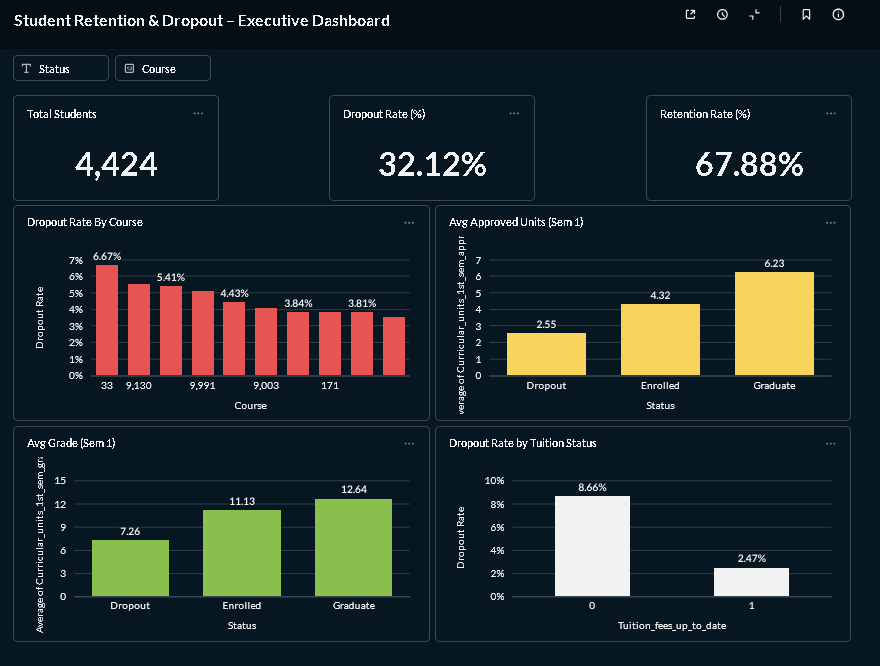

# Proyek Akhir: Menyelesaikan Permasalahan Perusahaan Edutech

## Business Understanding

Jaya Jaya Institut merupakan institusi pendidikan tinggi yang telah berdiri sejak tahun 2000
dan memiliki reputasi akademik yang baik. Namun demikian, institusi menghadapi tantangan
berupa tingginya jumlah mahasiswa yang tidak menyelesaikan pendidikan (dropout).

Permasalahan dropout berdampak pada:
- Reputasi institusi
- Efisiensi pengelolaan sumber daya pendidikan
- Keberlanjutan mutu proses pembelajaran

Oleh karena itu, institusi membutuhkan pendekatan berbasis data untuk memahami pola dropout
dan melakukan intervensi sedini mungkin.


### Permasalahan Bisnis

Permasalahan utama yang dihadapi adalah:
- Tingginya angka mahasiswa yang dropout
- Tidak adanya sistem peringatan dini untuk mendeteksi mahasiswa berisiko
- Sulitnya pimpinan institusi memantau kondisi dropout secara menyeluruh dan berbasis data

Tanpa intervensi dini, mahasiswa yang mengalami kesulitan akademik atau finansial
cenderung terlambat terdeteksi hingga akhirnya keluar dari sistem pendidikan.

### Cakupan Proyek

Cakupan proyek ini meliputi:
1. Analisis data mahasiswa untuk memahami karakteristik dropout
2. Pembangunan business dashboard untuk monitoring performa dan risiko dropout
3. Pengembangan model machine learning sebagai sistem early warning
4. Penyediaan prototype aplikasi berbasis Streamlit untuk simulasi risiko dropout

Proyek ini tidak bertujuan untuk menggantikan keputusan akademik,
melainkan sebagai alat bantu pengambilan keputusan berbasis data.

### Persiapan
Sumber data: 


Setup environment:

Untuk menjalankan app.py dalam lokal, pertama-tama anda perlu mengunduh folder projek ini. Setelah itu buka folder projek nya di vscode. Lalu buka terminal dalam vscode dan ketik ini:
```
python -m streamlit run app.py
```
Maka website streamlit projek ini akan terbuka.

## Business Dashboard

Business dashboard dikembangkan menggunakan Metabase dengan tujuan:
- Memberikan gambaran strategis kepada pimpinan (Rektor)
- Menampilkan metrik utama seperti dropout rate dan retention rate
- Mengidentifikasi program studi dengan risiko dropout tertinggi
- Menunjukkan sinyal akademik dan finansial yang berkaitan dengan dropout

Dashboard dirancang pada level agregat (tanpa menampilkan data individu mahasiswa)
dan berfokus pada insight yang dapat ditindaklanjuti secara strategis.



## Menjalankan Sistem Machine Learning
Untuk mencoba model yang telah dibuat , masuk ke link streamlit ini:

[](https://student-performance21.streamlit.app/)

Akan ada 7 input , yakni:

1️⃣ Age at Enrollment
(Umur saat mahasiswa pertama kali masuk)

2️⃣ Admission Grade
(Nilai saat diterima masuk perguruan tinggi)

3️⃣ Curricular Units Enrolled (Semester 1)
(Jumlah mata kuliah yang diambil di semester pertama)

4️⃣ Curricular Units Approved (Semester 1)
(Jumlah mata kuliah yang berhasil diluluskan)

5️⃣ Average Grade (Semester 1)
(Rata-rata nilai akademik semester pertama)

6️⃣ Scholarship Holder
(Status penerima beasiswa)

7️⃣ Tuition Fees Up to Date
(Status pembayaran uang kuliah)

Setelah semua kolom input sudah ditentukan nilai nya maka selanjutnya klik tombol "Predict Dropout Risk"

Maka akan diberikan output yang menunjukan:
- persentase peluang dropout pada mahasiswa
- rekomendasi aksi pada mahasiswa tersebut


## Conclusion

Berdasarkan hasil analisis dan pemodelan:
- Dropout mahasiswa tidak terjadi secara acak, tetapi memiliki pola yang dapat dikenali
- Performa akademik semester pertama merupakan indikator paling kuat terhadap risiko dropout
- Faktor finansial berperan sebagai faktor pendukung yang memperkuat risiko
- Model machine learning mampu digunakan sebagai sistem peringatan dini yang explainable

Pendekatan berbasis data memungkinkan institusi untuk beralih dari
reaktif menjadi preventif dalam menangani dropout mahasiswa.

### Rekomendasi Action Items 

Berdasarkan insight yang diperoleh, berikut rekomendasi yang dapat diterapkan:

1. **Early Academic Mentoring**  
   Mahasiswa dengan performa rendah pada semester pertama perlu
   langsung masuk ke program pendampingan akademik terstruktur.

2. **Intervensi Terfokus per Program Studi**  
   Program studi dengan tingkat dropout tertinggi perlu dilakukan
   evaluasi kurikulum awal dan sistem dukungan mahasiswa.

3. **Dukungan Finansial Tersegmentasi**  
   Mahasiswa dengan risiko akademik dan kendala finansial
   perlu diprioritaskan dalam program bantuan biaya atau skema pembayaran.

4. **Pemanfaatan Sistem Early Warning**  
   Model machine learning dan dashboard dapat digunakan
   sebagai alat monitoring rutin untuk mendukung pengambilan keputusan pimpinan.

Dengan implementasi rekomendasi tersebut, Jaya Jaya Institut diharapkan
dapat menekan angka dropout dan meningkatkan keberhasilan studi mahasiswa secara berkelanjutan.

## Akun Metabase:
Email: fauzanarisandiwoodward90@gmail.com

Pass:HRD123
